# Charts

Generated by [`../visualize.py`](../visualize.py) from the pipeline's data artifacts
(matplotlib). Each maps to a section of [`../patterns_report.md`](../patterns_report.md).
Regenerate with `python3 visualize.py` from the repo root.

### §1 — Project themes by size
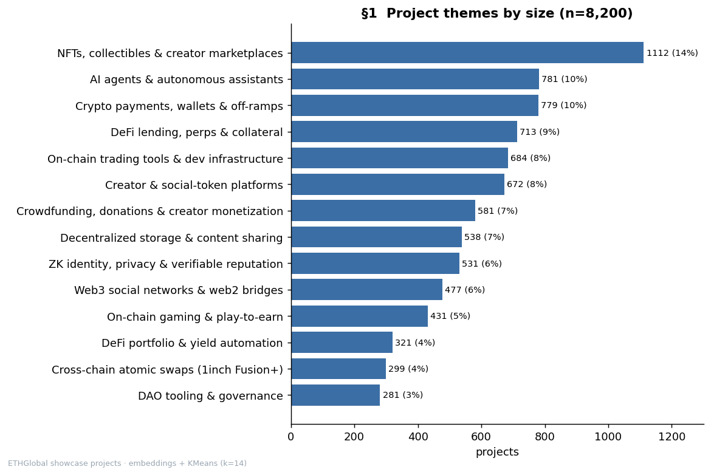

### §2 — The NFT → AI rotation
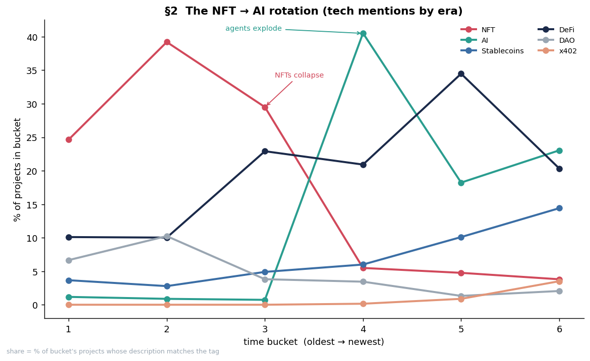

### §3 — Most-mentioned technologies
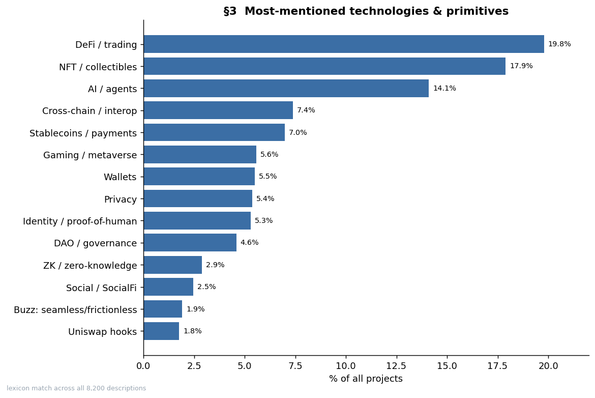

### §4 — Outliers (novelty + junk tail)
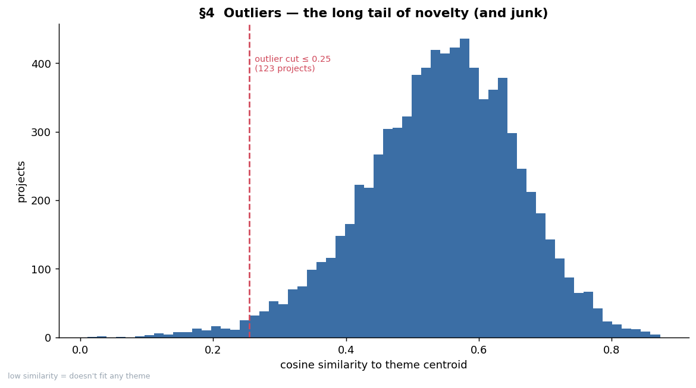

### §5 — Sub-themes of the two largest clusters
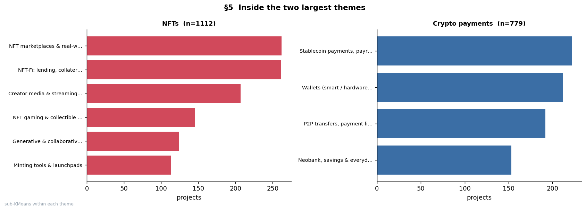

### §6 — Era-adjusted prize lift, and the era confound
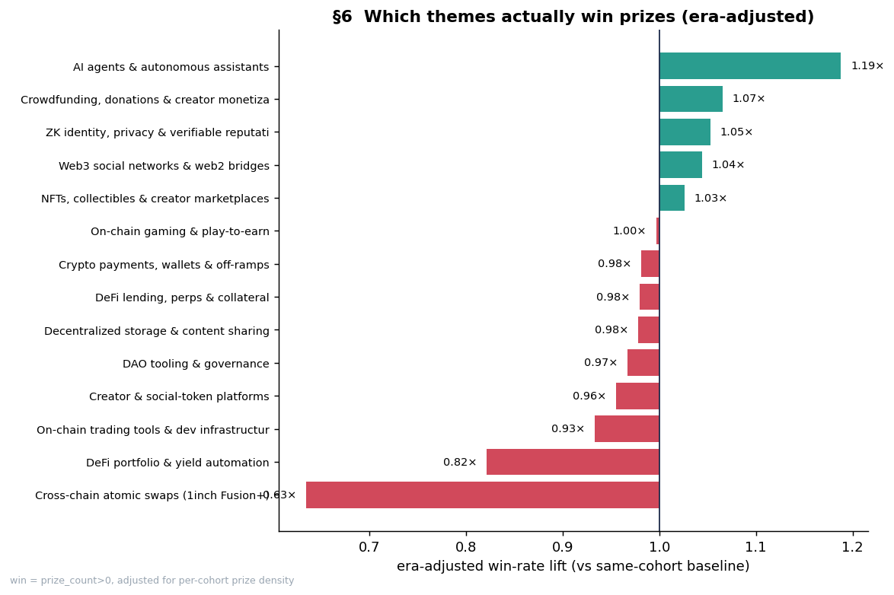
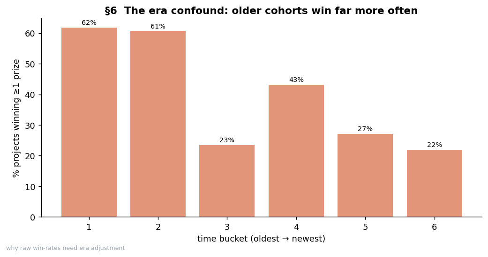

### §7 — Coinbase bankrolled the agent wave
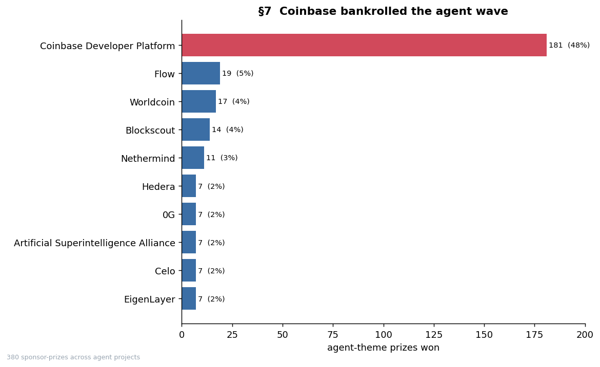

### §8 — Sponsor-alpha model: earmark, themed premium, decay
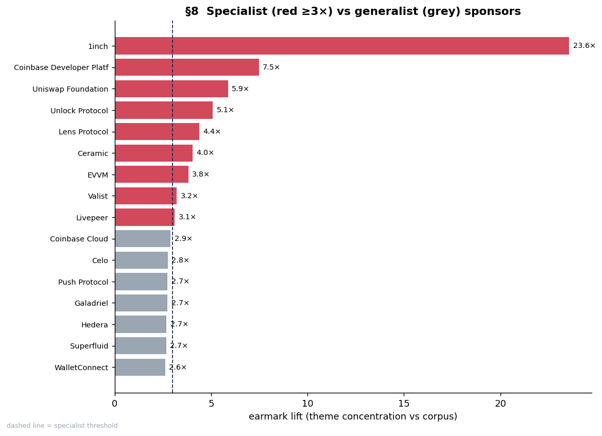
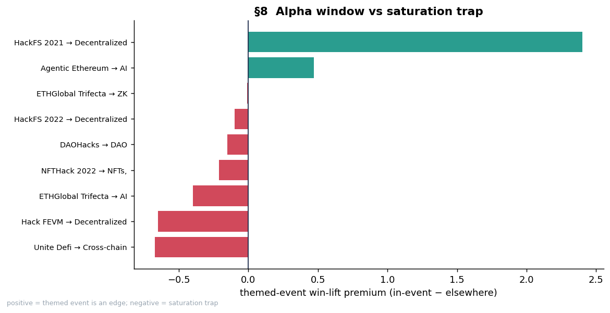
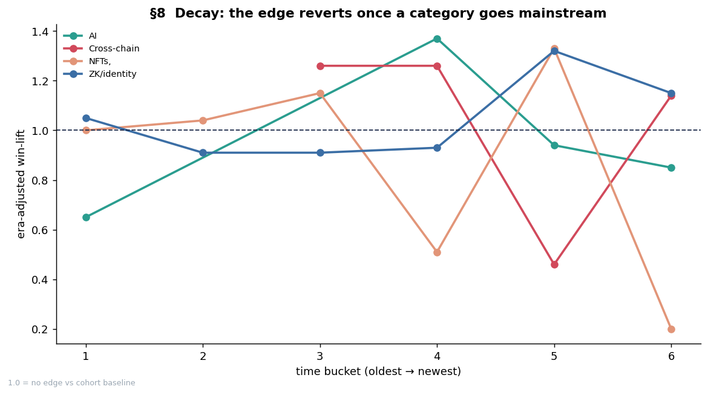

### §9 — Forward alpha forecast
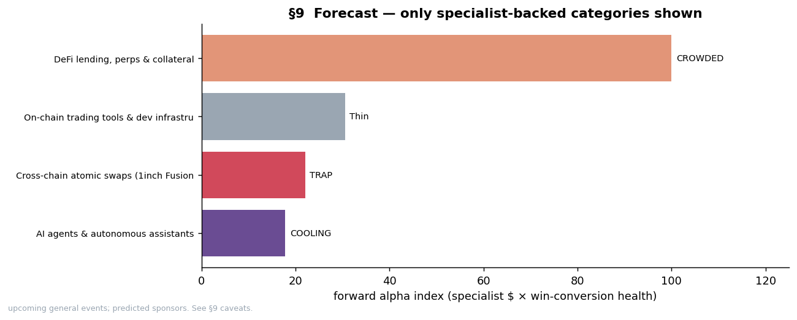
